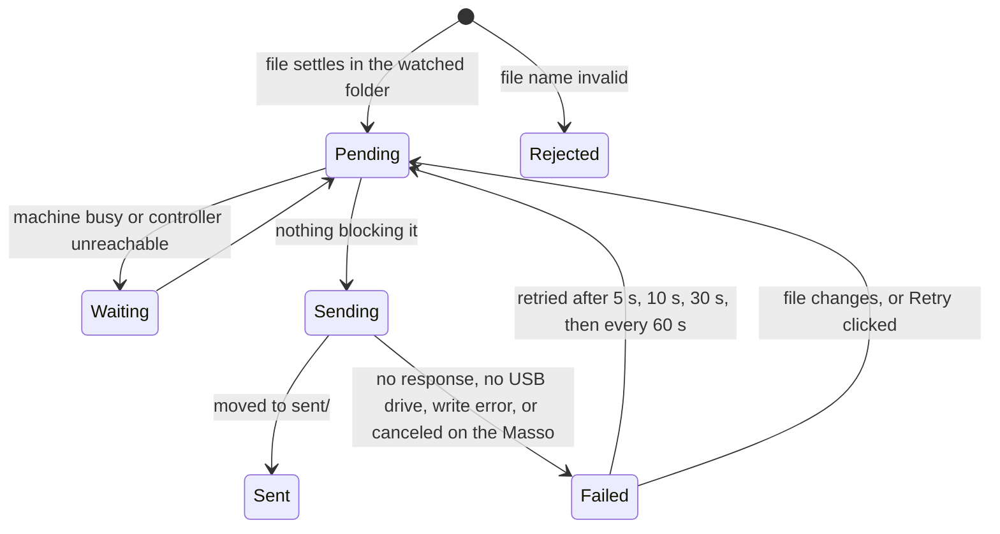

<!--
Copyright © 2026 Michael Shields

Licensed under the Apache License, Version 2.0 (the "License");
you may not use this file except in compliance with the License.
You may obtain a copy of the License at

    http://www.apache.org/licenses/LICENSE-2.0

Unless required by applicable law or agreed to in writing, software
distributed under the License is distributed on an "AS IS" BASIS,
WITHOUT WARRANTIES OR CONDITIONS OF ANY KIND, either express or implied.
See the License for the specific language governing permissions and
limitations under the License.
-->

# mink-lasso

A Windows app that sends G-code to a Masso G3 CNC controller automatically. It
does what Masso Link does—shows the machine's status and tool table and uploads
files to the controller's USB drive over the network—but instead of waiting for
you to drag a file in and click Send, it watches a folder and sends every new
file as soon as your CAM software has finished writing it. Sent files are moved
to a `sent` subfolder.

This is a clean-room implementation of the protocol described in
[docs/protocol.md](docs/protocol.md). It is not affiliated with Hind Technology.

## Install

Download `mink-lasso.exe` from the latest
[release](https://github.com/shields/mink-lasso/releases) and put it anywhere.
There is no installer and nothing else to install; it runs on 64-bit Windows 10
and 11.

On first launch, enter the controller's serial number (`G3-12345`, as shown on
the controller's F1 screen and in Masso Link) and choose the folder your CAM
post-processor writes to. The app finds the controller on the local network by
broadcast, connects, and starts watching the folder.

## How it works



A file is sent when it has **settled**: its size and modification time have not
changed for three seconds across two scans, and no other program has it open for
writing. CAM post-processors write output in place, so this is what keeps a
half-written file off the controller. The folder is rescanned every two seconds
in any case, so files still get picked up on network shares and after a burst of
changes that Windows fails to report.

The controller only accepts file names of up to **fifteen ASCII characters**
(including the extension, which must be one of `.nc`, `.txt`, `.cnc`, `.tap`,
`.eia`, `.htg`, `.wiz`, `.gcode`, or `.ngc`). Configure your post-processor
accordingly; a file with a longer or otherwise invalid name is reported as
rejected and left where it is until it is renamed.

Files that were sent before with the same name are overwritten on the
controller, just as Masso Link does. In the `sent` folder nothing is ever
overwritten: an older copy is renamed with a timestamp first, so the folder is a
complete history of what went to the machine.

### Machining

By default nothing is uploaded while the machine is running a program or waiting
for the operator, because the controller writes to the USB drive that the
running program is read from. A file that arrives mid-job waits, and is sent
once the machine has been idle for five seconds.

The protocol cannot distinguish a feed hold or an e-stop from a stopped program,
so if the machine went idle partway through a job, the app additionally waits
two minutes (`pauseGrace`) before treating it as stopped. This is a heuristic;
if you would rather upload while machining, turn on "Upload while machining" or
set `uploadWhileMachining` in the configuration.

### One client at a time

A Masso controller talks to a single client, and every discovery broadcast
re-targets every controller that hears it. Close Masso Link while mink-lasso is
running, and run only one instance of mink-lasso per controller (a second
instance on the same PC refuses to start). If you have several controllers on
one network, each PC running mink-lasso should be configured with the address of
its controller (`address`) so it can connect without broadcasting.

### Firewall

Replies arrive on a UDP port between 11000 and 11050, the same range Masso Link
uses. Windows Firewall lets replies to a request through without a rule, so a
normal desktop installation needs nothing. When the app runs as a service or
unattended, add a rule (as administrator):

```text
netsh advfirewall firewall add rule name="mink-lasso UDP" dir=in action=allow protocol=UDP localport=11000-11050
```

## Configuration

Settings are saved to `%APPDATA%\mink-lasso\config.json` as you change them in
the app—the serial number when you click Apply, the watch folder and "Upload
while machining" immediately—and the file is also readable and editable by hand:

| Key                    | Default                                         | Meaning                                                      |
| ---------------------- | ----------------------------------------------- | ------------------------------------------------------------ |
| `serial`               |                                                 | Controller to connect to, for example `G3-12345`             |
| `address`              |                                                 | Optional `host:port` to try before broadcasting              |
| `lastAddress`          |                                                 | Where the controller was last found; maintained by the app   |
| `watchDir`             |                                                 | Folder to watch                                              |
| `listenPort`           | `11000`                                         | First UDP port to try for replies (up to 11050)              |
| `scanInterval`         | `2s`                                            | How often the folder is rescanned                            |
| `settleDelay`          | `3s`                                            | How long a file must be unchanged before it is sent          |
| `pauseGrace`           | `2m`                                            | Extra wait after the machine goes idle partway through a job |
| `extensions`           | `.nc .txt .cnc .tap .eia .htg .wiz .gcode .ngc` | File types to send                                           |
| `uploadWhileMachining` | `false`                                         | Send files even while a program is running                   |
| `minimizeToTray`       | `true`                                          | Closing the window hides it to the notification area instead |
| `startMinimized`       | `false`                                         | Start hidden in the notification area                        |
| `logLevel`             | `info`                                          | `debug`, `info`, `warn`, or `error`                          |

Logs go to `%LOCALAPPDATA%\mink-lasso\logs\mink-lasso.log` (5 MiB, five files
kept).

## Command line

```text
mink-lasso.exe [-headless] [-config FILE] [-log-dir DIR] [-watch DIR] [-serial G3-12345] [-address HOST:PORT] [-log-level LEVEL] [-version]
```

`-headless` runs without a window, logging to the log file and also to standard
output—useful when stdout is redirected, as `make run` and the integration tests
do. The other flags override the corresponding configuration values for that run
only; they are never written to the config file by themselves—but clicking
Apply, Browse…, or the "Upload while machining" checkbox in the GUI saves the
values currently in effect, including any active override. `-version` prints the
version, which follows [gitcalver](https://gitcalver.org/): `20260825.2` is the
second build from August 25, 2026 (UTC).

`mink-lasso.exe` never has a console window, even with `-headless`: nothing
reads its standard output unless the launcher redirected it, and `Ctrl+C` has
nothing to reach. Stop it with `taskkill /IM mink-lasso.exe /F` or from Task
Manager. `make run` (`go run`, on any OS) builds a console program instead, so
`Ctrl+C` works there.

If another instance is already running, mink-lasso says so and exits with status
1; it exits the same way, naming Masso Link as the likely cause, if the UDP port
range is already in use. A bad flag, or `-headless` omitted on a platform with
no GUI, exits with status 2.

## Development

Everything goes through `make`: `make lint`, `make test`, `make coverage`
(requires 100% statement coverage), `make build` (cross-compiles
`dist/mink-lasso.exe` from any OS; needs nothing but Go), `make fmt`. Run
`lefthook install` once after cloning so `make lint` runs before every commit.

The GUI needs Windows, but everything else builds and tests on macOS and Linux.
`make sim` runs a simulated controller and
`make run RUN_ARGS="-watch /tmp/w -serial G3-1 -address 127.0.0.1:65535"` runs
the app headless against it; drop a file into `/tmp/w` and watch it move to
`/tmp/w/sent`.

### Integration tests

`internal/integration` runs against a real controller: discovery, status, the
tool table, uploads (`MLTEST1.NC` and `MLTEST2.NC`, then `MLTEST1.NC` again to
confirm overwriting), and an end-to-end test that starts the built exe headless
and drops `MLTEST3.NC` into a watched folder. The suite skips itself unless
`MINK_LASSO_SERIAL` is set, and skips the upload and end-to-end tests while the
machine is running unless `MINK_LASSO_ALLOW_RUNNING=1`. Delete the `MLTEST*.NC`
files from the USB drive whenever convenient.

The `integration` GitHub Actions workflow runs the suite on a self-hosted runner
on the shop PC. Start it with

```text
gh workflow run integration.yml -f serial=G3-12345
```

(or set the `MASSO_SERIAL` repository variable and omit `-f`). Requirements: a
USB drive in the controller, Masso Link closed, and nothing else talking to the
controller.

#### Setting up the runner

On the shop PC, as administrator:

1. Install [Git for Windows](https://git-scm.com/download/win) and GNU make
   (`choco install make` or `winget install ezwinports.make`); the runner uses
   Git Bash for its shell.
2. Add the firewall rule from [Firewall](#firewall) (the runner service has no
   desktop, so it cannot answer the firewall prompt).
3. Register the runner (the repository must stay private; GitHub advises against
   self-hosted runners on public repositories):

   ```text
   mkdir C:\actions-runner && cd C:\actions-runner
   curl -o actions-runner-win-x64.zip -L https://github.com/actions/runner/releases/download/v2.336.0/actions-runner-win-x64-2.336.0.zip
   tar xf actions-runner-win-x64.zip
   .\config.cmd --url https://github.com/shields/mink-lasso --token <token> --name masso-shop-pc --labels masso --unattended --runasservice
   ```

   Get `<token>` with
   `gh api -X POST repos/shields/mink-lasso/actions/runners/registration-token --jq .token`.
   The `masso` label is what the workflow selects on.

### Manual checks

Things the automated tests cannot cover, to check by hand on a Windows PC after
UI changes: the window at 100% and 150% display scaling; the notification-area
icon, its balloons, and its menu; Browse… for the folder; closing to the
notification area and restoring; File → Send file…; a second launch being
refused; and the messages shown for no USB drive, cancel on the controller, and
a feed hold during a job.

## License

Apache License 2.0; see [LICENSE](LICENSE).
