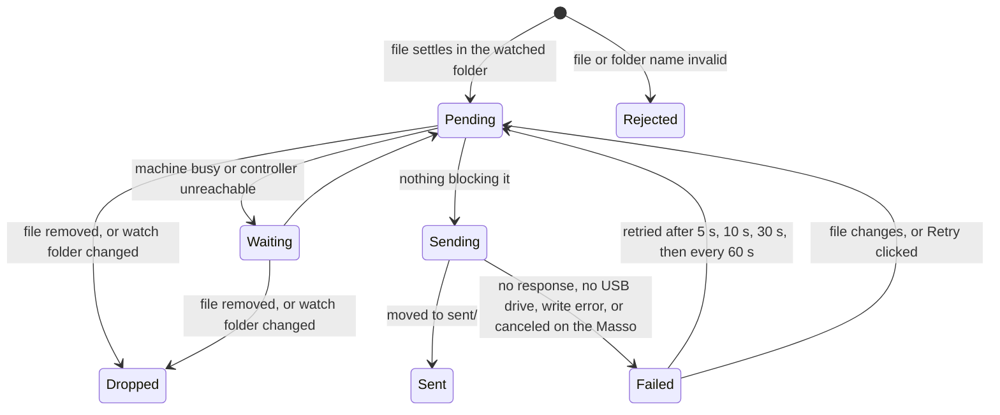

<!--
Copyright © 2026 Michael Shields

Licensed under the Apache License, Version 2.0 (the "License");
you may not use this file except in compliance with the License.
You may obtain a copy of the License at

    http://www.apache.org/licenses/LICENSE-2.0

Unless required by applicable law or agreed to in writing, software
distributed under the License is distributed on an "AS IS" BASIS,
WITHOUT WARRANTIES OR CONDITIONS OF ANY KIND, either express or implied.
See the License for the specific language governing permissions and
limitations under the License.
-->

# mink-lasso


A Windows app that sends G-code to a Masso G3 CNC controller automatically. It
does what Masso Link does—shows the machine's status and tool table and uploads
files to the controller's USB drive over the network—but instead of waiting for
you to drag a file in and click Send, it watches a folder and sends every new
file as soon as your CAM software has finished writing it. Sent files are moved
to a `sent` subfolder.

This is a clean-room implementation of the protocol described in
[docs/protocol.md](docs/protocol.md). It is not affiliated with Hind Technology.

## Install

Download `mink-lasso.exe` from the latest
[release](https://github.com/shields/mink-lasso/releases) and put it anywhere.
There is no installer and nothing else to install; it runs on 64-bit Windows 10
and 11.

On first launch, enter the controller's serial number (`G3-12345`, as shown on
the controller's F1 screen and in Masso Link) and choose the folder your CAM
post-processor writes to. The app finds the controller on the local network by
broadcast, connects, and starts watching the folder.

## How it works



A file is sent when it has **settled**: its size and modification time have not
changed for three seconds across two scans, and no other program has it open for
writing. CAM post-processors write output in place, so this is what keeps a
half-written file off the controller. The folder is rescanned every two seconds
in any case, so files still get picked up on network shares and after a burst of
changes that Windows fails to report.

The controller only accepts file names of up to **fifteen ASCII characters**
(including the extension, which must be one of `.nc`, `.txt`, `.cnc`, `.tap`,
`.eia`, `.htg`, `.wiz`, `.gcode`, or `.ngc`). Configure your post-processor
accordingly; a file with a longer or otherwise invalid name is reported as
rejected and left where it is until it is renamed.

Files that were sent before with the same name are overwritten on the
controller, just as Masso Link does. In the `sent` folder nothing is ever
overwritten: an older copy is renamed with a timestamp first, so the folder is a
complete history of what went to the machine.

Subfolders of the watched folder are watched too: a file in a subfolder is sent
into the matching folder on the controller's USB drive—the way Masso Link 2.15
preserves a dropped folder's structure—and archived into `sent` under that same
subfolder. Folder names must be printable ASCII too, though not limited to
fifteen characters, and the subfolder path as a whole at most 255; a file in a
folder that breaks these rules is rejected until the folder is renamed. Changes
made inside a subfolder are noticed by the periodic rescan rather than sped up
by a filesystem notification, which only ever covers the watched folder itself.
Whether the controller creates a folder on the USB drive that does not yet exist
has not been verified against real hardware—the protocol has no create-directory
request—so if a subfolder upload fails, create the folder on the USB drive by
hand first.

File → Send file… jumps the queue for one chosen file: a file inside the watched
folder goes wherever the watcher itself would send it, and any other file goes
to the root of the USB drive; either way it is left in place rather than moved
into `sent`.

### Machining

By default nothing is uploaded while the machine is running a program or waiting
for the operator, because the controller writes to the USB drive that the
running program is read from. A file that arrives mid-job waits, and is sent
once the machine has been idle for five seconds.

The protocol cannot distinguish a feed hold or an e-stop from a stopped program,
so if the machine went idle partway through a job, the app additionally waits
two minutes (`pauseGrace`) before treating it as stopped. This is a heuristic;
if you would rather upload while machining, turn on "Upload while machining" or
set `uploadWhileMachining` in the configuration.

### One client at a time

A Masso controller talks to a single client, and every discovery broadcast
re-targets every controller that hears it. Close Masso Link while mink-lasso is
running, and run only one instance of mink-lasso per controller (a second
instance on the same PC refuses to start). If you have several controllers on
one network, each PC running mink-lasso should be configured with the address of
its controller (`address`) so it can connect without broadcasting.

### Firewall

Replies arrive on a UDP port between 11000 and 11051, the range Masso Link uses.
Windows Firewall lets replies to a request through without a rule, so a normal
desktop installation needs nothing. When the app runs as a service or
unattended, add a rule (as administrator):

```text
netsh advfirewall firewall add rule name="mink-lasso UDP" dir=in action=allow protocol=UDP localport=11000-11051
```

## Configuration

Settings are saved to `%APPDATA%\mink-lasso\config.json` as you change them in
the app—the serial number when you click Apply, the watch folder and "Upload
while machining" immediately—and the file is also readable and editable by hand:

| Key                    | Default                                         | Meaning                                                      |
| ---------------------- | ----------------------------------------------- | ------------------------------------------------------------ |
| `serial`               |                                                 | Controller to connect to, for example `G3-12345`             |
| `address`              |                                                 | Optional `host:port` to try before broadcasting              |
| `lastAddress`          |                                                 | Where the controller was last found; maintained by the app   |
| `watchDir`             |                                                 | Folder to watch                                              |
| `listenPort`           | `11000`                                         | First UDP port to try for replies (up to 11051)              |
| `scanInterval`         | `2s`                                            | How often the folder is rescanned                            |
| `settleDelay`          | `3s`                                            | How long a file must be unchanged before it is sent          |
| `pauseGrace`           | `2m`                                            | Extra wait after the machine goes idle partway through a job |
| `extensions`           | `.nc .txt .cnc .tap .eia .htg .wiz .gcode .ngc` | File types to send                                           |
| `uploadWhileMachining` | `false`                                         | Send files even while a program is running                   |
| `minimizeToTray`       | `true`                                          | Closing the window hides it to the notification area instead |
| `startMinimized`       | `false`                                         | Start hidden in the notification area                        |
| `logLevel`             | `info`                                          | `debug`, `info`, `warn`, or `error`                          |

Logs go to `%LOCALAPPDATA%\mink-lasso\logs\mink-lasso.log` (5 MiB, five files
kept).

## Command line

```text
mink-lasso.exe [-headless] [-config FILE] [-log-dir DIR] [-watch DIR] [-serial G3-12345] [-address HOST:PORT] [-log-level LEVEL] [-version]
```

`-headless` runs without a window, logging to the log file and also to standard
output—useful when stdout is redirected, as `make run` and the integration tests
do. The other flags override the corresponding configuration values for that run
only; they are never written to the config file by themselves—but clicking
Apply, Browse…, or the "Upload while machining" checkbox in the GUI saves the
values currently in effect, including any active override. `-version` prints the
version, which follows [gitcalver](https://gitcalver.org/): `20260825.2` is the
second build from August 25, 2026 (UTC).

`mink-lasso.exe` never has a console window, even with `-headless`: nothing
reads its standard output unless the launcher redirected it, and `Ctrl+C` has
nothing to reach. Stop it with `taskkill /IM mink-lasso.exe /F` or from Task
Manager. `make run` (`go run`, on any OS) builds a console program instead, so
`Ctrl+C` works there.

If another instance is already running, mink-lasso says so and exits with status
1; it exits the same way, naming Masso Link as the likely cause, if the UDP port
range is already in use. A bad flag, or `-headless` omitted on a platform with
no GUI, exits with status 2.

## Development

Everything goes through `make`: `make lint`, `make test`, `make coverage`
(requires 100% statement coverage), `make build` (cross-compiles
`dist/mink-lasso.exe` from any OS; needs nothing but Go), `make fmt`. Run
`lefthook install` once after cloning so `make lint` runs before every commit.

The GUI needs Windows, but everything else builds and tests on macOS and Linux.
`make sim` runs a simulated controller and
`make run RUN_ARGS="-watch /tmp/w -serial G3-1 -address 127.0.0.1:65535"` runs
the app headless against it; drop a file into `/tmp/w` and watch it move to
`/tmp/w/sent`.

### Integration tests

`internal/integration` runs against a real controller: discovery, status, the
tool table, uploads (`MLTEST1.NC` and `MLTEST2.NC`, then `MLTEST1.NC` again to
confirm overwriting, then `MLTEST4.NC` into an `MLTEST` folder), and an
end-to-end test that starts the built exe headless and drops `MLTEST3.NC` into a
watched folder. The suite skips itself unless `MINK_LASSO_SERIAL` is set, and
skips the upload and end-to-end tests while the machine is running unless
`MINK_LASSO_ALLOW_RUNNING=1`. Delete the `MLTEST*.NC` files and the `MLTEST`
folder from the USB drive whenever convenient.

Run it by hand from Git Bash on a Windows PC on the controller's LAN, with Go
and GNU make installed (`choco install make` or
`winget install ezwinports.make`), the controller powered up with a USB drive in
it, Masso Link closed, and nothing else talking to the controller:

```text
MINK_LASSO_SERIAL=G3-12345 make integration
```

`make integration` builds the exe first and hands it to the end-to-end test
through `MINK_LASSO_EXE`. Add the firewall rule from [Firewall](#firewall) once
beforehand: `go test` builds a fresh test binary on every run, so Windows
Firewall would otherwise prompt each time, and a prompt left unanswered for a
second is a failed discovery.

### Controller probes

`make probe` runs `TestProbe`, an opt-in suite that records what a real
controller does in the situations [docs/protocol.md](docs/protocol.md) marks
unverified — the ones only real hardware can settle. It logs observations,
prefixed `PROBE Q<n>:`, for a human to paste back into
[docs/protocol-questions.md](docs/protocol-questions.md); it does not assert
anything about that unknown behavior, and fails only on a harness error or an
unsafe condition (the machine running, or the controller going unreachable).
Like `make integration`, it skips unless `MINK_LASSO_SERIAL` is set, and skips
while the machine is running unless `MINK_LASSO_ALLOW_RUNNING=1`; unlike
`make integration`, it never runs as a side effect of the ordinary suite — it
needs `MINK_LASSO_PROBE=1` too, which `make probe` sets for you:

```text
MINK_LASSO_SERIAL=G3-12345 make probe
```

Close Masso Link and mink-lasso first, exactly as for `make integration`: a
controller talks to one client at a time. Setting `MINK_LASSO_ADDR=host:port`
(as `-address` does for the app itself) skips broadcast discovery entirely, for
either suite — useful on a LAN where broadcast is filtered, or to point
`make probe` at [`make sim`](#development) while trying it out.

**`MINK_LASSO_PROBE_LONG_NAMES=1`** turns on one more probe, Q12, on top of
`MINK_LASSO_PROBE=1`:

```text
MINK_LASSO_SERIAL=G3-12345 MINK_LASSO_PROBE_LONG_NAMES=1 make probe
```

It uploads two comments-only files with names longer than
[docs/protocol.md](docs/protocol.md) §5's documented 15-character limit — one 16
characters, one 33 — built by hand, since `masso.UploadStart` itself refuses
either. It is a separate opt-in because that 15-character limit is only a
documented assumption: nothing establishes what a real controller does with a
longer name, and firmware built around the assumption could mishandle one in a
way the app-level check was quietly protecting against. Every packet Q12 sends
is still a well-formed, documented request — the risk is entirely in how the
controller's own firmware parses a name it may not expect, not in anything
malformed reaching it.

Each probe sends only well-formed packets of documented types, and every file
and folder name it uses starts with `MLTEST`, so it is easy to find and delete
from the USB drive afterward. Every probe that opens a transfer (a start request
the controller acknowledges) closes it again — either by finishing normally or
by sending the post-transfer signal — before it returns, even if it fails or is
skipped partway through; nothing here relies on a probe reaching its own final
line to avoid leaving a transfer open on the controller.

| Probe | What it does                                                                                                                                                                                                                            | Leaves behind                                                                                       |
| ----- | --------------------------------------------------------------------------------------------------------------------------------------------------------------------------------------------------------------------------------------- | --------------------------------------------------------------------------------------------------- |
| Q7/Q8 | Captures the raw identity and config replies, for the operator to read off which bits carry what                                                                                                                                        | nothing                                                                                             |
| Q2    | Resends an upload-start request and records the reply, then finishes one file continuing from chunk 0 and a second sending chunk 1 before chunk 0                                                                                       | `MLTESTQ2A.NC`, `MLTESTQ2B.NC`                                                                      |
| Q3    | Sends a start while another transfer is open; only if that second start is refused, sends a couple of its chunks and records their ACKs                                                                                                 | `MLTESTQ3A.NC`, `MLTESTQ3B.NC`                                                                      |
| Q4    | Sends a few chunks, the post-transfer signal, then one more chunk                                                                                                                                                                       | `MLTESTQ4.NC` (left partial)                                                                        |
| Q5    | Uploads into a new, uniquely-named folder under `MLTEST\` that cannot already exist                                                                                                                                                     | an `MLTEST\MLTESTQ5-<timestamp>` folder, possibly containing `MLTESTQ5.NC`                          |
| Q6    | Uploads into six folders under `MLTEST\` whose names probe edge cases (embedded/trailing spaces and periods, punctuation, a ~209-byte component)                                                                                        | six `MLTEST\MLTESTQ6*` folders, each possibly containing `MLTESTQ6.NC`                              |
| Q12   | Opt-in (`MINK_LASSO_PROBE_LONG_NAMES=1`): hand-builds and sends upload-start requests for two names longer than the documented 15-character limit (16 and 33 characters), finishing the transfer only for a name the controller accepts | `MLTESTQ12-XXX.NC`, `MLTESTQ12-XXXXXXXXXXXXXXXXXXXX.NC` — only with `MINK_LASSO_PROBE_LONG_NAMES=1` |
| Q9    | Polls status for up to 3 minutes for a 33-character file name — Q12's own upload if it completed, otherwise one pre-staged by hand (see "Preparing Q9" below); Q9 itself uploads nothing                                                | nothing beyond what Q12 already left, or the pre-staged file left as placed                         |

After it runs, check the controller's own file browser by hand. Every probe
sends only well-formed packets, but what the controller actually does with them
— create the file, leave it partial, refuse it, or something else — is exactly
what several of these probes exist to observe, so none of the states below is
guaranteed:

- `MLTESTQ2A.NC` — ordinarily a complete one-chunk file, sent after the
  deliberate resend; absent if the first start was refused.
- `MLTESTQ2B.NC` — complete, partial, or absent, depending on whether the
  controller accepts chunk 0 after chunk 1 arrived first; this is extra
  information from reusing the same resend setup, not itself one of
  docs/protocol-questions.md's numbered questions. Absent if the first start was
  refused.
- `MLTESTQ3A.NC` — opened but never chunked, then closed with the post-transfer
  signal; what that leaves behind is itself an open question
  (docs/protocol-questions.md Q4).
- `MLTESTQ3B.NC` — if a start sent while another transfer was open was accepted
  (question 3 not exercised that run), it is opened but never chunked, then
  closed only with the post-transfer signal, exactly like `MLTESTQ3A.NC` above:
  what that leaves behind is itself an open question (docs/protocol-questions.md
  Q4). If that second start was refused instead, the probe also sends chunks 0
  and 1 to see whether the controller stores them anyway — but either way it
  then closes with the post-transfer signal too, just like the accepted branch.
  So in the refused case this file's final state depends on both questions, not
  question 3 alone: whether the controller stored chunks sent after a refused
  start (docs/protocol-questions.md Q3), and what the post-transfer signal that
  follows then does to them (docs/protocol-questions.md Q4).
- `MLTESTQ4.NC` — always partial: only chunks 0-2 of 4 are ever sent, and the
  post-transfer signal goes out after chunk 1.
- the `MLTEST\MLTESTQ5-<timestamp>` folder, and `MLTESTQ5.NC` inside it —
  present or absent depending on whether the controller creates a missing
  directory (docs/protocol-questions.md Q5).
- the six `MLTEST\MLTESTQ6*` folders below, and `MLTESTQ6.NC` inside whichever
  of them were created — which of the six were created at all is exactly what
  docs/protocol-questions.md Q6 asks. Three differ only by a trailing space or
  period, easy to miss by eye in a file browser, so they are spelled out here
  rather than left to the `*`:
  - `MLTEST\MLTESTQ6 SPACE` (embedded space)
  - `MLTEST\MLTESTQ6.DOT` (embedded period)
  - `MLTEST\MLTESTQ6.` (trailing period)
  - `MLTEST\MLTESTQ6 ` (trailing space)
  - `MLTEST\MLTESTQ6-PUNCT!@#$%^&()_+-=[]{}',;~` (assorted printable
    punctuation)
  - `MLTEST\MLTESTQ6-` followed by 200 `X`s (~209-byte component)
- `MLTESTQ12-XXX.NC` (16 characters) and `MLTESTQ12-XXXXXXXXXXXXXXXXXXXX.NC` (33
  characters) — only with `MINK_LASSO_PROBE_LONG_NAMES=1`. Present, partial, or
  absent, and under its full name or a truncated one, depending on how the
  controller handles a name over the documented 15-character limit — exactly
  what Q12 exists to observe; check the controller's own file browser for each.
- the file used for Q9 (below) — Q12's own 33-character upload when
  `MINK_LASSO_PROBE_LONG_NAMES=1` produced one and it completed, otherwise left
  exactly as the operator placed it; Q9 itself only polls status, it never
  uploads anything.

Delete anything above once read; a later run reuses a fresh
`MLTESTQ5-<timestamp>` name and overwrites `MLTESTQ2A.NC`, `MLTESTQ4.NC`, the Q6
files, and (with `MINK_LASSO_PROBE_LONG_NAMES=1`) the Q12 files, so nothing
needs cleaning up between runs.

**Preparing Q9.** If `MINK_LASSO_PROBE_LONG_NAMES=1` was set and Q12's own
33-character upload (above) was accepted and completed, Q9 uses that file
automatically and none of this preparation is needed — its log line says which
file it is polling for either way. Otherwise: before running, from a PC, create
a comments-only file named exactly `MLTESTQ99999999999999999999999.NC` (33
characters) containing:

```text
(mink-lasso probe q9)
(comments only, no motion)
(uploaded to test a 33-character file name)
```

and copy it to the USB drive's root — `make probe` never builds or sends this
file itself, since docs/protocol.md never establishes that the controller
accepts an upload-start request naming a file this long. When the test prints
that it is ready, load — do not run — that file on the controller's own screen;
Q9 then polls status for up to 3 minutes for the name to appear, logs the raw
bytes of the status packet's file-name field and the byte immediately after it,
and skips with a clear message if the name never appears in that time. Running
`make probe` again after loading it late is fine.

Q3's log line also explains an optional manual step: rerunning with the USB
drive removed observes the one error result (`0xE9`) docs/protocol.md documents
a specific cause for, though nothing else in the suite can run without a drive
present.

### Manual checks

Things the automated tests cannot cover, to check by hand on a Windows PC after
UI changes: the window at 100% and 150% display scaling; the notification-area
icon, its balloons, and its menu; Browse… for the folder; closing to the
notification area and restoring; File → Send file…; a second launch being
refused; and the messages shown for no USB drive, cancel on the controller, and
a feed hold during a job.

## License

Apache License 2.0; see [LICENSE](LICENSE).
