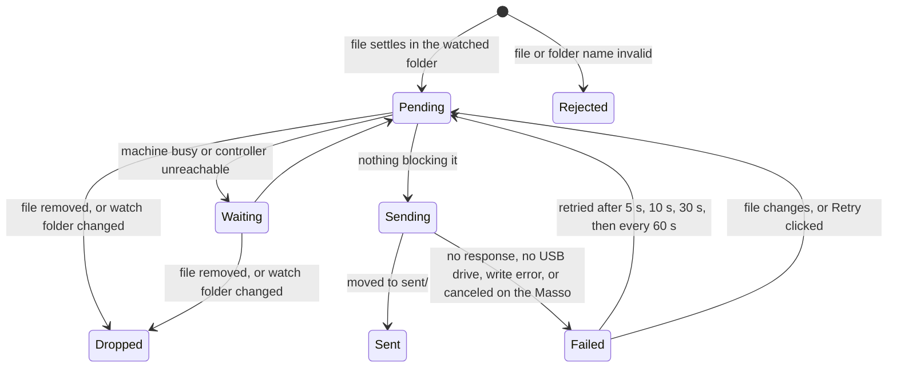

<!--
Copyright © 2026 Michael Shields

Licensed under the Apache License, Version 2.0 (the "License");
you may not use this file except in compliance with the License.
You may obtain a copy of the License at

    http://www.apache.org/licenses/LICENSE-2.0

Unless required by applicable law or agreed to in writing, software
distributed under the License is distributed on an "AS IS" BASIS,
WITHOUT WARRANTIES OR CONDITIONS OF ANY KIND, either express or implied.
See the License for the specific language governing permissions and
limitations under the License.
-->

# mink-lasso


A Windows app that sends G-code to a Masso G3 CNC controller automatically. It
does what Masso Link does—shows the machine's status and tool table and uploads
files to the controller's USB drive over the network—but instead of waiting for
you to drag a file in and click Send, it watches a folder and sends every new
file as soon as your CAM software has finished writing it. Sent files are moved
to a `sent` subfolder.

This is a clean-room implementation of the protocol described in
[docs/protocol.md](docs/protocol.md). It is not affiliated with Hind Technology.

## Install

Download `mink-lasso.exe` from the latest
[release](https://github.com/shields/mink-lasso/releases) and put it anywhere.
There is no installer and nothing else to install; it runs on 64-bit Windows 10
and 11.

On first launch, enter the controller's serial number (`G3-12345`, as shown on
the controller's F1 screen and in Masso Link) and choose the folder your CAM
post-processor writes to. The app finds the controller on the local network by
broadcast, connects, and starts watching the folder.

## How it works


```mermaid
stateDiagram-v2
    [*] --> Pending: file settles in the watched folder
    [*] --> Rejected: file or folder name invalid
    Pending --> Waiting: machine busy or controller unreachable
    Waiting --> Pending
    Pending --> Sending: nothing blocking it
    Sending --> Sent: moved to sent/
    Sending --> Failed: no response, no USB drive, write error, or canceled on the Masso
    Failed --> Pending: retried after 5 s, 10 s, 30 s, then every 60 s
    Failed --> Pending: file changes, or Retry clicked
    Pending --> Dropped: file removed, or watch folder changed
    Waiting --> Dropped: file removed, or watch folder changed
```

A file is sent when it has **settled**: its size and modification time have not
changed for three seconds across two scans, and no other program has it open for
writing. CAM post-processors write output in place, so this is what keeps a
half-written file off the controller. The folder is rescanned every two seconds
in any case, so files still get picked up on network shares and after a burst of
changes that Windows fails to report.

File names may be up to **33 characters** long, including the extension, which
must be one of `.nc`, `.txt`, `.cnc`, `.tap`, `.eia`, `.htg`, `.wiz`, `.gcode`,
or `.ngc`: that is the longest name the controller reports in full, and a real
controller has accepted and stored names that long. They must be printable ASCII
without `\ / : * ? " < > |`, which Windows and the USB drive's FAT file system
forbid anyway. Configure your post-processor accordingly; a file with a longer
or otherwise invalid name is reported as rejected and left where it is until it
is renamed.

Files that were sent before with the same name are overwritten on the
controller, just as Masso Link does. In the `sent` folder nothing is ever
overwritten: an older copy is renamed with a timestamp first, so the folder is a
complete history of what went to the machine.

Subfolders of the watched folder are watched too: a file in a subfolder is sent
into the matching folder on the controller's USB drive—the way Masso Link 2.15
preserves a dropped folder's structure—and archived into `sent` under that same
subfolder. Folder names must be printable ASCII too, though not limited to 33
characters, and the subfolder path as a whole at most 255; a file in a folder
that breaks these rules is rejected until the folder is renamed. Changes made
inside a subfolder are noticed by the periodic rescan rather than sped up by a
filesystem notification, which only ever covers the watched folder itself. The
controller creates a folder on the USB drive that does not yet exist.

File → Send file… jumps the queue for one chosen file: a file inside the watched
folder goes wherever the watcher itself would send it, and any other file goes
to the root of the USB drive; either way it is left in place rather than moved
into `sent`.

### Machining

By default nothing is uploaded while the machine is running a program or waiting
for the operator, because the controller writes to the USB drive that the
running program is read from. A file that arrives mid-job waits, and is sent
once the machine has been idle for five seconds.

The protocol cannot distinguish a feed hold or an e-stop from a stopped program,
so if the machine went idle partway through a job, the app additionally waits
two minutes (`pauseGrace`) before treating it as stopped. This is a heuristic;
if you would rather upload while machining, turn on "Upload while machining" or
set `uploadWhileMachining` in the configuration.

### One client at a time

A Masso controller talks to a single client, and every discovery broadcast
re-targets every controller that hears it. Close Masso Link while mink-lasso is
running, and run only one instance of mink-lasso per controller (a second
instance on the same PC refuses to start). If you have several controllers on
one network, each PC running mink-lasso should be configured with the address of
its controller (`address`) so it can connect without broadcasting.

### Firewall

Replies arrive on a UDP port between 11000 and 11051, the range Masso Link uses.
Windows Firewall lets replies to a request through without a rule, so a normal
desktop installation needs nothing. When the app runs as a service or
unattended, add a rule (as administrator):

```text
netsh advfirewall firewall add rule name="mink-lasso UDP" dir=in action=allow protocol=UDP localport=11000-11051
```

## Configuration

Settings are saved to `%APPDATA%\mink-lasso\config.json` as you change them in
the app—the serial number when you click Apply, the watch folder and "Upload
while machining" immediately—and the file is also readable and editable by hand:

| Key                    | Default                                         | Meaning                                                      |
| ---------------------- | ----------------------------------------------- | ------------------------------------------------------------ |
| `serial`               |                                                 | Controller to connect to, for example `G3-12345`             |
| `address`              |                                                 | Optional `host:port` to try before broadcasting              |
| `lastAddress`          |                                                 | Where the controller was last found; maintained by the app   |
| `watchDir`             |                                                 | Folder to watch                                              |
| `listenPort`           | `11000`                                         | First UDP port to try for replies (up to 11051)              |
| `scanInterval`         | `2s`                                            | How often the folder is rescanned                            |
| `settleDelay`          | `3s`                                            | How long a file must be unchanged before it is sent          |
| `pauseGrace`           | `2m`                                            | Extra wait after the machine goes idle partway through a job |
| `extensions`           | `.nc .txt .cnc .tap .eia .htg .wiz .gcode .ngc` | File types to send                                           |
| `uploadWhileMachining` | `false`                                         | Send files even while a program is running                   |
| `minimizeToTray`       | `true`                                          | Closing the window hides it to the notification area instead |
| `startMinimized`       | `false`                                         | Start hidden in the notification area                        |
| `logLevel`             | `info`                                          | `debug`, `info`, `warn`, or `error`                          |

Logs go to `%LOCALAPPDATA%\mink-lasso\logs\mink-lasso.log` (5 MiB, five files
kept).

## Command line

```text
mink-lasso.exe [-headless] [-config FILE] [-log-dir DIR] [-watch DIR] [-serial G3-12345] [-address HOST:PORT] [-log-level LEVEL] [-version]
```

`-headless` runs without a window, logging to the log file and also to standard
output—useful when stdout is redirected, as `make run` and the integration tests
do. The other flags override the corresponding configuration values for that run
only; they are never written to the config file by themselves—but clicking
Apply, Browse…, or the "Upload while machining" checkbox in the GUI saves the
values currently in effect, including any active override. `-version` prints the
version, which follows [gitcalver](https://gitcalver.org/): `20260825.2` is the
second build from August 25, 2026 (UTC). The exe's Properties dialog shows the
same product version, and file version `2026.8.25.2`, because Windows holds that
one as four 16-bit numbers.

`mink-lasso.exe` never has a console window, even with `-headless`: nothing
reads its standard output unless the launcher redirected it, and `Ctrl+C` has
nothing to reach. Stop it with `taskkill /IM mink-lasso.exe /F` or from Task
Manager. `make run` (`go run`, on any OS) builds a console program instead, so
`Ctrl+C` works there.

If another instance is already running, mink-lasso says so and exits with status
1; it exits the same way, naming Masso Link as the likely cause, if the UDP port
range is already in use. A bad flag, or `-headless` omitted on a platform with
no GUI, exits with status 2.

## Development

Everything goes through `make`: `make lint`, `make test`, `make coverage`
(requires 100% statement coverage), `make build` (cross-compiles
`dist/mink-lasso.exe` from any OS; needs nothing but Go), `make fmt`. Run
`lefthook install` once after cloning so `make lint` runs before every commit.

The GUI needs Windows, but everything else builds and tests on macOS and Linux.
`make sim` runs a simulated controller and
`make run RUN_ARGS="-watch /tmp/w -serial G3-1 -address 127.0.0.1:65535"` runs
the app headless against it; drop a file into `/tmp/w` and watch it move to
`/tmp/w/sent`.

### Integration tests

`internal/integration` runs against a real controller: discovery, status, the
tool table, uploads (`MLTEST1.NC` and `MLTEST2.NC`, then `MLTEST1.NC` again to
confirm overwriting, then `MLTEST4.NC` into an `MLTEST` folder), and an
end-to-end test that starts the built exe headless and drops `MLTEST3.NC` into a
watched folder. The suite skips itself unless `MINK_LASSO_SERIAL` is set, and
skips the upload and end-to-end tests while the machine is running unless
`MINK_LASSO_ALLOW_RUNNING=1`. Delete the `MLTEST*.NC` files and the `MLTEST`
folder from the USB drive whenever convenient.

Run it by hand from Git Bash on a Windows PC on the controller's LAN, with Go
and GNU make installed (`choco install make` or
`winget install ezwinports.make`), the controller powered up with a USB drive in
it, Masso Link closed, and nothing else talking to the controller:

```text
MINK_LASSO_SERIAL=G3-12345 make integration
```

`make integration` builds the exe first and hands it to the end-to-end test
through `MINK_LASSO_EXE`. Add the firewall rule from [Firewall](#firewall) once
beforehand: `go test` builds a fresh test binary on every run, so Windows
Firewall would otherwise prompt each time, and a prompt left unanswered for a
second is a failed discovery.

### Controller probes

`make probe` runs `TestProbe`, an opt-in suite that repeats the experiments
behind what [docs/protocol.md](docs/protocol.md) records from probes — the
behavior only real hardware can show — so that a new firmware version can be
checked against it. It logs what the controller does, prefixed `PROBE Q<n>:`
after the question each probe was written to answer; it does not assert that
behavior, since a new firmware version may change it, and fails only on a
harness error or an unsafe condition (the machine running, or the controller
going unreachable). Like `make integration`, it skips unless `MINK_LASSO_SERIAL`
is set, and skips while the machine is running unless
`MINK_LASSO_ALLOW_RUNNING=1`; unlike `make integration`, it never runs as a side
effect of the ordinary suite — it needs `MINK_LASSO_PROBE=1` too, which
`make probe` sets for you:

```text
MINK_LASSO_SERIAL=G3-12345 make probe
```

Close Masso Link and mink-lasso first, exactly as for `make integration`: a
controller talks to one client at a time. Setting `MINK_LASSO_ADDR=host:port`
(as `-address` does for the app itself) skips broadcast discovery entirely, for
either suite — useful on a LAN where broadcast is filtered, or to point
`make probe` at [`make sim`](#development) while trying it out.

**`MINK_LASSO_PROBE_LONG_NAMES=1`** turns on one more probe, Q12, on top of
`MINK_LASSO_PROBE=1`:

```text
MINK_LASSO_SERIAL=G3-12345 MINK_LASSO_PROBE_LONG_NAMES=1 make probe
```

It uploads two comments-only files with long names, built by hand: one of 34
characters, one over mink-lasso's own 33-character limit, which
`masso.UploadStart` refuses, and one of 33. It is a separate opt-in because
nothing establishes the longest name a real controller accepts
([docs/protocol.md](docs/protocol.md) §5), and firmware could mishandle one
longer than it expects. Every packet Q12 sends is still a well-formed,
documented request — the risk is entirely in how the controller's own firmware
parses a name it may not expect, not in anything malformed reaching it.

Each probe sends only well-formed packets of documented types, and every file
and folder name it uses starts with `MLTEST`, so it is easy to find and delete
from the USB drive afterward. Every probe that opens a transfer (a start request
the controller accepts) finishes it by sending, in order, every chunk the
controller has not yet accepted, even if the probe fails or is skipped partway
through. Nothing else closes a transfer: the post-transfer signal does not
([docs/protocol.md](docs/protocol.md) §5.5), and one left unfinished stays open,
showing "Receiving" on the controller's screen, until it is canceled there by
hand. If a probe cannot finish a transfer, it logs that the transfer may still
be open; the status packet does not show it, so check the screen and cancel any
such transfer before rerunning. Between probes, the run stops unless the
controller answers a status request with a status reply.

| Probe | What it does                                                                                                                                                                                                       | Leaves behind                                                                                                                                                                                              |
| ----- | ------------------------------------------------------------------------------------------------------------------------------------------------------------------------------------------------------------------ | ---------------------------------------------------------------------------------------------------------------------------------------------------------------------------------------------------------- |
| Q7/Q8 | Captures the raw identity and config replies, for the operator to read off which bits carry what                                                                                                                   | nothing                                                                                                                                                                                                    |
| Q2    | Resends an upload-start request and records the reply, then finishes one file continuing from chunk 0 and a second sending chunk 1 before chunk 0                                                                  | `MLTESTQ2A.NC`, `MLTESTQ2B.NC`                                                                                                                                                                             |
| Q3    | Sends a start while another transfer is open, then finishes both; with the USB drive removed, the first start is refused instead, and the probe sends that file's chunks and records their ACKs                    | `MLTESTQ3A<nnn>.NC` (stuck until the controller restarts), `MLTESTQ3B<nnn>.NC`                                                                                                                             |
| Q4    | Starts `MLTESTQ4N.NC` and sends the post-transfer signal before any chunk; then sends two chunks of `MLTESTQ4.NC`, the signal, then the remaining chunks, which the controller refuses                             | whatever the signal leaves of `MLTESTQ4N.NC` and `MLTESTQ4.NC` (ordinarily nothing); "Receiving MLTESTQ4.NC" stays on the screen (at 66%) until the next probe starts a transfer or it is canceled by hand |
| Q14   | Opens a transfer and sends one chunk, sends the same start again, then the post-transfer signal, then the start once more, and finishes whatever that opens                                                        | `MLTESTQ14<nnn>.NC`, complete if the signal freed its name, otherwise stuck until the controller restarts                                                                                                  |
| Q13   | Uploads `MLTESTQ13A.NC` and `MLTESTQ13B.NC`, waits, then sends the post-transfer signal, which deletes the most recent upload; watch the controller's screen, which should show nothing for it                     | `MLTESTQ13A.NC`                                                                                                                                                                                            |
| Q5    | Uploads into a new, uniquely-named folder under `MLTEST\` that cannot already exist                                                                                                                                | an `MLTEST\MLTESTQ5-<timestamp>` folder, possibly containing `MLTESTQ5.NC`                                                                                                                                 |
| Q6    | Uploads into six folders under `MLTEST\` whose names probe edge cases (embedded/trailing spaces and periods, punctuation, a ~209-byte component)                                                                   | six `MLTEST\MLTESTQ6*` folders, each possibly containing `MLTESTQ6.NC`                                                                                                                                     |
| Q12   | Opt-in (`MINK_LASSO_PROBE_LONG_NAMES=1`): hand-builds and sends upload-start requests for a 34-character name, one over mink-lasso's limit, and a 33-character one, finishing each transfer the controller accepts | `MLTESTQ12-XXXXXXXXXXXXXXXXXXXXX.NC`, `MLTESTQ12-XXXXXXXXXXXXXXXXXXXX.NC` — only with `MINK_LASSO_PROBE_LONG_NAMES=1`                                                                                      |
| Q9    | Polls status for up to 3 minutes for a 33-character file name — Q12's own upload if it completed, otherwise one pre-staged by hand (see "Preparing Q9" below); Q9 itself uploads nothing                           | nothing beyond what Q12 already left, or the pre-staged file left as placed                                                                                                                                |

After it runs, check the controller's own file browser by hand. Every probe
sends only well-formed packets, but what the controller actually does with them
— create the file, leave it partial, refuse it, or something else — is exactly
what several of these probes exist to observe, so none of the states below is
guaranteed:

- `MLTESTQ2A.NC` — ordinarily a complete one-chunk file, sent after the
  deliberate resend; absent if the first start was refused.
- `MLTESTQ2B.NC` — ordinarily complete: after sending chunk 1 before chunk 0,
  the probe finishes the file in order. Absent if the first start was refused.
- `MLTESTQ3A<nnn>.NC` — `<nnn>` is three hex digits, new each run. Opened, then
  displaced by the start for `MLTESTQ3B<nnn>.NC`: the controller keeps one
  transfer at a time and never closes the displaced one, so this is a 0-byte
  file it will not delete, and a start for this name draws `0xF7`, until the
  controller restarts ([docs/protocol.md](docs/protocol.md) §5.5). The probe
  logs that it could not finish it; that is expected. Delete it from a PC, or on
  the controller after a restart. With the USB drive removed, its start is
  refused instead, and the probe sends its chunk to see whether the controller
  stores it anyway (docs/protocol.md §5.1).
- `MLTESTQ3B<nnn>.NC` — complete if the second start was accepted (question 3
  not exercised that run). If that start was refused instead, the probe sends
  chunks 0 and 1 to see whether the controller stores them anyway
  (docs/protocol.md §5.1), so the file may be complete, partial, or absent.
- `MLTESTQ4N.NC` — started and then signaled before any chunk: ordinarily absent
  (docs/protocol.md §5.5).
- `MLTESTQ4.NC` — ordinarily absent: the controller refuses chunks sent after
  the post-transfer signal and removes the partial file. Its screen keeps
  showing "Receiving MLTESTQ4.NC" at 66% until another transfer starts (Q5, in a
  full run) or it is canceled by hand (docs/protocol.md §5.5).
- `MLTESTQ14<nnn>.NC` — `<nnn>` is three hex digits, new each run. Complete if
  the post-transfer signal freed the transfer left open before it
  (docs/protocol.md §5.5); otherwise that name may stay stuck, like
  `MLTESTQ3A<nnn>.NC`, until the controller restarts.
- the `MLTEST\MLTESTQ5-<timestamp>` folder, and `MLTESTQ5.NC` inside it —
  ordinarily present: the controller creates a missing directory
  (docs/protocol.md §5.1).
- the six `MLTEST\MLTESTQ6*` folders below, and `MLTESTQ6.NC` inside whichever
  of them were created — ordinarily all six (docs/protocol.md §5.1). Three
  differ only by a trailing space or period, easy to miss by eye in a file
  browser, so they are spelled out here rather than left to the `*`:
  - `MLTEST\MLTESTQ6 SPACE` (embedded space)
  - `MLTEST\MLTESTQ6.DOT` (embedded period)
  - `MLTEST\MLTESTQ6.` (trailing period)
  - `MLTEST\MLTESTQ6 ` (trailing space)
  - `MLTEST\MLTESTQ6-PUNCT!@#$%^&()_+-=[]{}',;~` (assorted printable
    punctuation)
  - `MLTEST\MLTESTQ6-` followed by 200 `X`s (~209-byte component)
- `MLTESTQ12-XXXXXXXXXXXXXXXXXXXXX.NC` (34 characters) and
  `MLTESTQ12-XXXXXXXXXXXXXXXXXXXX.NC` (33 characters) — only with
  `MINK_LASSO_PROBE_LONG_NAMES=1`. The 33-character one is ordinarily complete;
  the 34-character one is present, partial, or absent, under its full name or a
  truncated one, depending on how the controller handles it — exactly what Q12
  exists to observe; check the controller's own file browser.
- the file used for Q9 (below) — Q12's own 33-character upload when
  `MINK_LASSO_PROBE_LONG_NAMES=1` produced one and it completed, otherwise left
  exactly as the operator placed it; Q9 itself only polls status, it never
  uploads anything.

Delete anything above once read; a later run uses fresh Q3 and
`MLTESTQ5-<timestamp>` names and overwrites `MLTESTQ2A.NC`, `MLTESTQ4.NC`, the
Q6 files, and (with `MINK_LASSO_PROBE_LONG_NAMES=1`) the Q12 files, so nothing
needs cleaning up between runs.

**Preparing Q9.** If `MINK_LASSO_PROBE_LONG_NAMES=1` was set and Q12's own
33-character upload (above) was accepted and completed, Q9 uses that file
automatically and none of this preparation is needed — its log line says which
file it is polling for either way. Otherwise: before running, from a PC, create
a comments-only file named exactly `MLTESTQ99999999999999999999999.NC` (33
characters) containing:

```text
(mink-lasso probe q9)
(comments only, no motion)
(uploaded to test a 33-character file name)
```

and copy it to the USB drive's root — `make probe` never builds or sends this
file itself, since docs/protocol.md never establishes that the controller
accepts an upload-start request naming a file this long. When the test prints
that it is ready, load — do not run — that file on the controller's own screen;
Q9 then polls status for up to 3 minutes for the name to appear, logs the raw
bytes of the status packet's file-name field and the byte immediately after it,
and skips with a clear message if the name never appears in that time. Running
`make probe` again after loading it late is fine.

Q3's log line also explains an optional manual step: rerunning with the USB
drive removed observes the one error result (`0xE9`) docs/protocol.md documents
a specific cause for, though nothing else in the suite can run without a drive
present.

### Manual checks

Things the automated tests cannot cover, to check by hand on a Windows PC after
UI changes: the window at 100% and 150% display scaling; the notification-area
icon, its balloons, and its menu; Browse… for the folder; closing to the
notification area and restoring; File → Send file…; a second launch being
refused; and the messages shown for no USB drive, cancel on the controller, and
a feed hold during a job.

## License

Apache License 2.0; see [LICENSE](LICENSE).
